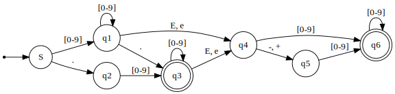

# TDDB44

albar556 & marka727

## Lab 1

### Assigment 1
#### Identifers
```
[A-Za-z_][A-Za-z_0-9]*
```
#### Constants
##### Integer
```
[0-9]+
```
##### Real

```
([0-9]+\.[0-9]*|[0-9]*\.[0-9]+)((E|e)(\+|-)?[0-9]+)?|[0-9]+((E|e)(\+|-)?[0-9]+)
```
[RegExr Test](https://regexr.com/7ml9c)
##### Strings
```
'([^'\n]|'')*'
```
### Assignment 2

#### DIESEL float


